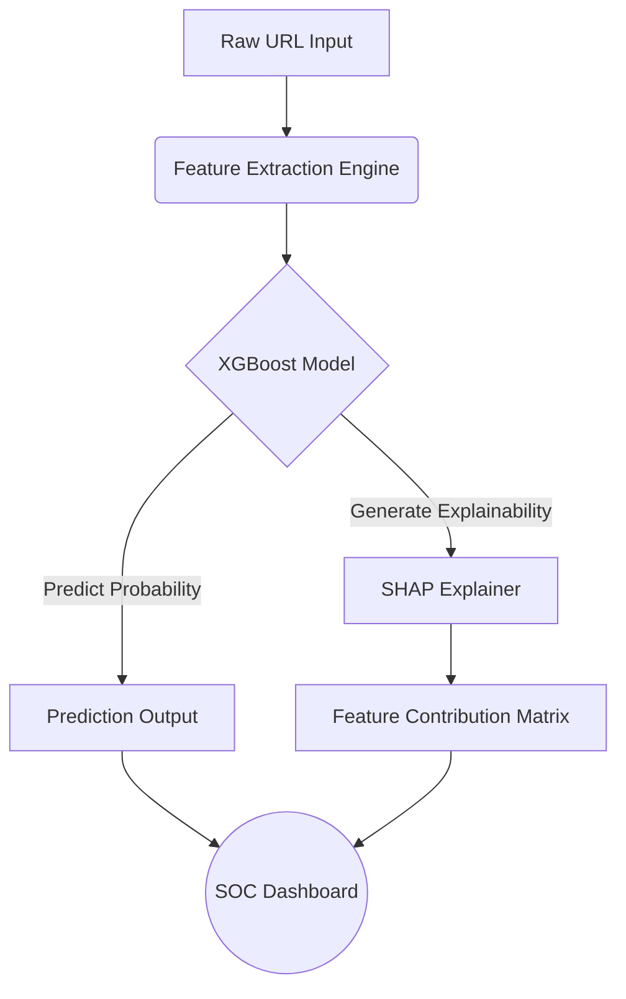

<div align="center">
  <h1>🛡️ PhishXplain</h1>
  <p><strong>Next-Generation Explainable Machine Learning Pipeline for Phishing URL Detection</strong></p>

  <p>
    
    
    
    
    
  </p>
</div>

---

## 📖 Overview

**PhishXplain** is a robust, real-time phishing detection system that moves beyond traditional "black-box" AI models. By integrating **SHAP (Shapley Additive exPlanations)**, it provides transparent, feature-level accountability for every prediction. Security teams and end-users no longer just see a "phishing" or "safe" label—they see exactly *why* a URL was flagged.

Developed to address critical research gaps in traditional phishing detection systems, this project tackles class imbalance (via **SMOTE**) and significantly enhances interpretability.

---

## ✨ Key Features

- 🔍 **Explainable AI (XAI)**: Generates dynamic attribution matrices showing why a URL was flagged (e.g., missing SSL, suspicious subdomains).
- ⚖️ **Imbalance Handling**: Leverages SMOTE (Synthetic Minority Over-sampling Technique) to eliminate majority-class bias, ensuring high recall for critical phishing threats.
- ⚡ **Live Feature Extraction Engine**: Automatically parses raw URLs and extracts 14 distinct lexical and network features in milliseconds.
- 🖥️ **SOC Web Dashboard**: A sleek, dark-mode, glassmorphism UI built for Security Operations Center (SOC) analysts to visualize threats in real-time.
- 🚀 **High-Speed Microservice**: Containerized **FastAPI** backend delivering sub-millisecond inference latency.

---

## 🏗️ System Architecture



1. **Data Pipeline**: Ingests the UCI Phishing Websites dataset, applies stratified splitting, and normalizes features using `StandardScaler`.
2. **Model Training**: Utilizes `GridSearchCV` to hyper-tune an **XGBoost Classifier** specifically optimized for F1-score.
3. **Inference API**: A FastAPI backend exposes `/predict` (for real-time URL scoring and SHAP generation) and `/feedback` (for continuous learning loops).
4. **Presentation Layer**: A vanilla HTML/CSS/JS frontend utilizing **Chart.js** to render dynamic SHAP waterfall/bar charts.

---

## 🚀 Quick Start

### Prerequisites
- Python 3.10+
- Git
- Docker (Optional, for containerized deployment)

### Standard Installation

1. **Clone the repository:**
   ```bash
   git clone https://github.com/Kaizer321/PhishXplain.git
   cd PhishXplain
   ```

2. **Install required dependencies:**
   ```bash
   pip install -r requirements.txt
   ```

3. **Run the FastAPI server:**
   ```bash
   uvicorn api:app --host 0.0.0.0 --port 8000
   ```

4. **Access the SOC Dashboard:**
   Open your browser and navigate to: **`http://localhost:8000`**

### Docker Deployment

If you prefer running via Docker, ensuring complete environment consistency:

```bash
docker build -t phishxplain .
docker run -p 8000:8000 phishxplain
```

---

## 🔬 Ablation Study Results

To prove the efficacy of the proposed methodology, an ablation study was conducted against a standard baseline:

| Model Configuration | Accuracy | Recall | AUC Score |
| :--- | :--- | :--- | :--- |
| **Baseline (No SMOTE)** | 97.60% | 96.43% | 0.9967 |
| **Proposed (+SMOTE)** | 97.47% | **96.73%** | 0.9963 |

> **Note:** While raw accuracy drops slightly, the critical **Recall** metric (the ability to successfully catch actual phishing sites) strictly improves when applying SMOTE.

---

## 🔌 API Documentation

### `POST /predict`
Analyzes a URL and returns the threat probability and SHAP feature contributions.

**Request:**
```json
{
  "url": "http://secure-update-paypal-account-verify.com"
}
```

**Response:**
```json
{
  "url": "http://secure-update-paypal-account-verify.com",
  "phishing_probability": 0.7189,
  "is_phishing": true,
  "explanation": {
    "base_value": -0.0054,
    "feature_contributions": {
      "sslfinal_state": 5.9613,
      "having_ip_address": -0.2642
    }
  },
  "latency_ms": 18.9
}
```

---

## 🎓 Academic Context

This project was developed as part of **Fall 2025 - Information Security (AI-B)**. It extends and improves upon the base paper: *"Enhancing phishing detection: A machine learning approach with feature selection and deep learning models" (Nayak et al., 2025)* by introducing proper class balancing and XAI frameworks.

---

<div align="center">
  <p>Made with ❤️ by the PhishXplain Team</p>
</div>
